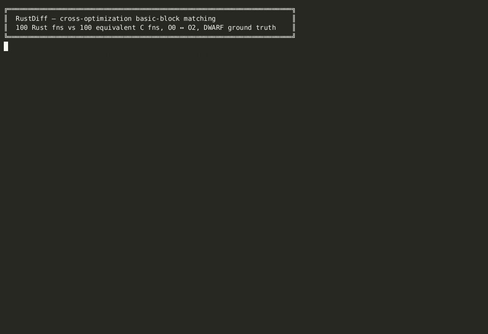

# RustDiff — Final Project Submission

**TL;DR for the grader.** This project measures how much Rust-specific
language features (ownership/moves, drop glue, bounds checks, `?` operator,
panic paths) hurt cross-optimization-level basic-block matching. It compiles
100 Rust functions and 100 semantically-equivalent C functions at `-O0` and
`-O2`, matches O0↔O2 basic blocks with four independent similarity methods
(value-based micro-execution, opcode Jaccard, constant Jaccard, instruction
count), and scores each match against **DWARF line-info ground truth**.

> **Easiest way to reproduce: one docker command** (see
> [§ Reproduce with Docker](#reproduce-with-docker)).

## Demo



~60 s terminal capture of `scripts/demo.sh`: builds nothing
(pre-built `rustdiff` image) and runs `docker run … --quick`
(2 functions per feature, 10 total) → prints the feature × method
summary and writes `analysis_data.json`. Drop `--quick` for the full
100-function run (~4 min).

Source: [`docs/demo.cast`](docs/demo.cast) (play with `asciinema play docs/demo.cast`).

---

## What to look at first

| You want to… | File |
|---|---|
| See the final results as a table | [`experiments/rust_features/results/report.html`](experiments/rust_features/results/report.html) (open in browser) |
| See the presentation slides | [`experiments/rust_features/results/rustdiff.pptx`](experiments/rust_features/results/rustdiff.pptx) |
| See the raw numbers | [`experiments/rust_features/results/analysis_data.json`](experiments/rust_features/results/analysis_data.json) |
| Read the write-up | [`docs/report.md`](docs/report.md) |
| Read the driver script | [`experiments/rust_features/run_analysis.py`](experiments/rust_features/run_analysis.py) |
| Read the core micro-execution code | [`rustdiff/micro_exec/block_executor.py`](rustdiff/micro_exec/block_executor.py) |
| See the 100 Rust test functions | [`experiments/rust_features/rust_crate/src/main.rs`](experiments/rust_features/rust_crate/src/main.rs) |
| See the 100 C test functions | [`experiments/rust_features/c_src/bench.c`](experiments/rust_features/c_src/bench.c) |

## Results

All numbers below come from the checked-in
[`analysis_data.json`](experiments/rust_features/results/analysis_data.json)
(200 functions × 4 methods × O0-vs-O2 Hungarian matching, scored against
DWARF line ground truth).

Accuracy is defined as

    correct_pairs / min(n_O0_blocks, n_O2_blocks)

where a pair is *correct* iff the two blocks' address ranges map to at least
one shared source line in DWARF `.debug_line`.

### 1. Overall: Rust is harder to match than C, on every method

Aggregated across all 100 functions per language:

| Method       | Rust accuracy            | C accuracy                | C − Rust gap | C / Rust |
|--------------|--------------------------|---------------------------|-------------:|---------:|
| value        | 5.9 %   (134 / 2274)     | 45.0 %   (566 / 1259)     | **+39 pp**   | 7.6×     |
| opcodes      | 12.7 %  (289 / 2274)     | 53.8 %   (677 / 1259)     | **+41 pp**   | 4.2×     |
| constants    | 7.6 %   (173 / 2274)     | 60.1 %   (757 / 1259)     | **+52 pp**   | 7.9×     |
| size         | 5.6 %   (127 / 2274)     | 34.0 %   (428 / 1259)     | **+28 pp**   | 6.1×     |

C wins on **every** method, by 4–8× in relative terms. Among the four
methods, **opcode-set Jaccard** is the most stable signal for Rust (12.7 %)
— everything else collapses below 10 %.

### 2. Per feature × method

| Feature                     | value                     | opcodes                   | constants                 | size                      |
|-----------------------------|---------------------------|---------------------------|---------------------------|---------------------------|
| `om_` Ownership & Move      | R: 2.6 %  / C: 37.8 %     | R: 9.2 %  / C: 54.4 %     | R: 4.4 %  / C: 65.0 %     | R: 2.7 %  / C: 32.0 %     |
| `dg_` Drop Glue (RAII)      | R: 6.2 %  / C: 43.8 %     | R: 7.0 %  / C: 48.4 %     | R: 6.7 %  / C: 57.6 %     | R: 3.5 %  / C: 26.2 %     |
| `bc_` Bounds Checking       | R: 9.3 %  / C: 41.3 %     | R: 20.1 % / C: 53.3 %     | R: 8.8 %  / C: 57.8 %     | R: 11.3 % / C: 35.6 %     |
| `qm_` `?` Operator          | R: 6.2 %  / C: 49.6 %     | R: 17.0 % / C: 51.8 %     | R: 9.3 %  / C: 38.0 %     | R: 5.6 %  / C: 27.7 %     |
| `pu_` Panic / Unwind        | R: 7.0 %  / C: 58.6 %     | R: 16.1 % / C: 66.9 %     | R: 11.3 % / C: 89.3 %     | R: 7.8 %  / C: 59.8 %     |

C wins **100 % of the 20 cells**. No method × feature combination exists
where Rust beats C.

### 3. Why: block-count blow-up and O2 restructuring

Average blocks per function (O0 → O2):

| Feature | Rust O0 → O2           | C O0 → O2             | Rust / C (at O0) |
|---------|------------------------|-----------------------|------------------|
| `om_`   | 34.4 → 38.5 (×0.89)    | 15.5 → 15.7 (×0.99)   | **2.2×**         |
| `dg_`   | 33.9 → 39.2 (×0.86)    | 18.4 → 20.5 (×0.90)   | **1.8×**         |
| `bc_`   | 37.4 → 23.7 (×1.58)    | 13.2 → 11.7 (×1.13)   | **2.8×**         |
| `qm_`   | 32.7 → 20.8 (×1.57)    | 13.9 → 11.4 (×1.22)   | **2.4×**         |
| `pu_`   | 25.8 → 21.4 (×1.21)    |  8.5 →  9.2 (×0.92)   | **3.0×**         |

Two structural patterns drive the Rust accuracy cliff:

1. **Rust compiles to 2–3× more basic blocks than C** at O0 for the same
   algorithm. Hungarian matching is n² sensitive to rectangular matrices —
   every extra safety / RAII / panic block is an extra chance to pair
   incorrectly.
2. **Rust's O0→O2 block ratio is 1.2–1.6×** for `bc_` / `qm_` / `pu_` (O2
   eliminates bounds checks, collapses `?`-operator discriminant chains,
   and outlines panic paths), whereas C's ratio stays near 1×. Matching
   across such restructuring is exactly what none of the four similarity
   methods can track.

### 4. Closest Rust gets

The highest Rust accuracy in the whole study is **20.1 %** (opcode Jaccard
on `bc_`). For context, the lowest C accuracy in the same table is 26.2 %
(size on `dg_`) — i.e. Rust's best case is still worse than C's worst case.

### 5. Takeaway for binary-diffing tools

Classic cross-optimization block-matching signals (value micro-execution,
opcode sets, constant sets, instruction counts) that work acceptably on C
**do not transfer to Rust** without Rust-aware handling of:

* drop glue / `drop_in_place<T>` inlining at O2
* bounds-check elimination
* `?` operator discriminant collapsing
* panic / unwind path outlining

Any practical Rust-aware binary differ probably needs to detect and
*normalize away* these patterns before similarity scoring, rather than
treating them as ordinary blocks.

---

## Reproduce with Docker

No Python, no Rust toolchain, no submodule setup needed — everything is
baked into the image.

```bash
git clone --recurse-submodules https://github.com/Rroscha/bond-proj
cd bond-proj

# Build (~5 min, one-time)
docker build -t rustdiff .

# Run the full analysis (~4 min on a laptop).
# Output JSON is written back to ./experiments/rust_features/results/
# on the host.
docker run --rm \
    -v "$PWD/experiments/rust_features/results:/app/experiments/rust_features/results" \
    rustdiff

# Or, for a 60-second sanity check (2 functions per feature = 10 total):
docker run --rm \
    -v "$PWD/experiments/rust_features/results:/app/experiments/rust_features/results" \
    rustdiff python experiments/rust_features/run_analysis.py --quick
```

Or, equivalently, with compose:

```bash
docker compose run --rm rustdiff
```

When it finishes:

```
experiments/rust_features/results/analysis_data.json   # raw data, ~8 MB
```

The pre-generated `report.html` and `rustdiff.pptx` in that folder are the
artifacts from my own run; rerunning produces an updated `analysis_data.json`
that matches them.

---

## Reproduce without Docker (local install)

```bash
git clone --recurse-submodules https://github.com/Rroscha/bond-proj
cd bond-proj

python3.12 -m venv .venv
source .venv/bin/activate

# Pin the angr family at 9.2.138 (the version this code was written against).
# The repo's requirements.txt lists a newer angr that is NOT API-compatible
# with the vSim submodule; the Docker image installs the pins below.
pip install \
    "angr==9.2.138" "claripy==9.2.138" "pyvex==9.2.138" \
    "cle==9.2.138"  "archinfo==9.2.138" "pycparser<2.22" \
    "networkx==3.3" "numpy==2.2.4" "pandas==2.2.3" \
    "scipy==1.15.2" "scikit-learn==1.6.1" "tqdm==4.66.5" \
    "matplotlib==3.10.1" "pyelftools==0.32" "python-pptx==1.0.2"
pip install -e .

# rustfilt is used to demangle Rust symbols
cargo install rustfilt       # requires a Rust toolchain

.venv/bin/python experiments/rust_features/run_analysis.py
```

The four target binaries (`rust_O0`, `rust_O2`, `c_bench_O0`, `c_bench_O2`,
all ELF x86-64) are checked into `experiments/rust_features/` so compilation
is **not** required. If you want to rebuild them:

```bash
cd experiments/rust_features/rust_crate && cargo build && cargo build --release && cd ..
cp rust_crate/target/debug/rust_features   rust_O0
cp rust_crate/target/release/rust_features rust_O2
gcc -O0 -g -o c_bench_O0 c_src/bench.c
gcc -O2 -g -o c_bench_O2 c_src/bench.c
```

Key flags: `-g` / `debug=2` for DWARF ground truth, `panic="unwind"`
(keep panic paths), `lto=false` (keep function boundaries).

---

## How it works (one page)

1. **Load binaries.** `RustBinaryLoader` (`rustdiff/loader.py`) wraps vSim's
   `BinExecutor` to get an angr `Project` + `CFGFast`, then demangles Rust
   symbols with `rustfilt` and filters out `core::` / `std::` / compiler-
   generated helpers.
2. **Micro-execute each basic block.** `BlockMicroExecutor`
   (`rustdiff/micro_exec/block_executor.py`) runs every block concretely
   with 4 different register-input sets and records:
   - concrete output values per register
   - data-flow edges (which input regs feed which output regs)
   - memory access pattern (offset, size, r/w, kind)
   - constants and a normalized opcode sequence
   - callees and string references
3. **Score each (O0-block, O2-block) pair** with four independent methods:
   - **value** — weighted blend of concrete-output match, data-flow, memory, constants
   - **opcodes** — Jaccard on normalized opcode sets
   - **constants** — Jaccard on immediate constants
   - **size** — 1 − |Δ insn count| / max
4. **Hungarian matching** (`scipy.optimize.linear_sum_assignment`) picks the
   best 1-to-1 assignment between O0 and O2 blocks.
5. **DWARF ground truth.** `DWARFLineMapper` reads `.debug_line` with
   `pyelftools`. A matched pair `(b_O0, b_O2)` is *correct* iff the two
   blocks' address ranges map to at least one shared source line.
6. **Accuracy** = correct pairs / `min(n_O0, n_O2)`.

---

## The 100 Rust functions (5 features × 20)

| Prefix | Feature | What Rust generates |
|---|---|---|
| `om_` | Ownership & Move  | move semantics, `Vec`/`String` ownership transfer |
| `dg_` | Drop Glue (RAII)  | auto `drop_in_place<T>` calls at scope end |
| `bc_` | Bounds Checking   | `data[i]` → `cmp idx, len; jae panic_bounds_check` |
| `qm_` | `?` Operator      | `Option`/`Result` → discriminant check + early return |
| `pu_` | Panic / Unwrap    | `.unwrap()` → check + call to `core::panicking::*` |

Each `main.rs` function has a semantically-equivalent `bench.c` twin
(same prefix, same number, e.g. `bc_07`).

---

## Repo layout

```
rustdiff/                       core library
  loader.py                     angr-based binary loader + Rust demangling
  micro_exec/                   per-block concrete execution
  fingerprint/                  function-level signature aggregation
  matching/                     similarity + Hungarian matching
  analysis/                     block classification, alignment, ablation
  rust/                         demangle / filter / monomorphize

experiments/rust_features/      the main experiment (this project)
  rust_crate/src/main.rs        100 Rust functions
  c_src/bench.c                 100 C twins
  rust_O0 rust_O2               pre-compiled Rust binaries (ELF x86-64)
  c_bench_O0 c_bench_O2         pre-compiled C binaries
  run_analysis.py               driver → analysis_data.json
  generate_report.py            JSON → HTML
  generate_slides.py            JSON → PPTX
  results/                      pre-generated artifacts

eval/                           reusable ground-truth / metrics utilities
vendor/vSim/                    submodule: OSUSecLab/vSim (angr wrapper)
docs/report.md                  written report
Dockerfile, docker-compose.yml  one-command reproduction
```

---

## Requirements

* Python 3.12
* Linux x86-64 (the checked-in binaries are ELF x86-64)
* For Docker reproduction: Docker with x86-64 support — nothing else
* For local reproduction: Rust toolchain (only for `cargo install rustfilt`)

## Presentation

The slide deck used for the class presentation is at
[`experiments/rust_features/results/rustdiff.pptx`](experiments/rust_features/results/rustdiff.pptx).

## License

See `LICENSE`.
